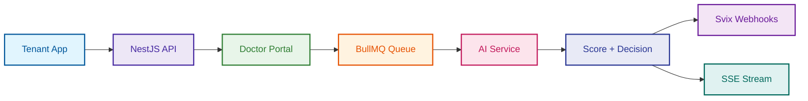

# Meayar — Backend API

[](https://nestjs.com/)
[](https://www.prisma.io/)
[](https://www.postgresql.org/)
[](https://redis.io/)
[](https://www.docker.com/)

**Keywords**: `Multi-tenant SaaS`, `Doctor Credential Verification`, `Algeria Digital Economy`, `BullMQ Pipeline`, `Webhook Delivery`, `Dual Auth`, `Portal Session`, `Svix`, `Cloudflare R2`.

> **The trust layer for the Algerian digital healthcare economy.** A multi-tenant API platform that allows healthcare organisations to verify doctor credentials programmatically — receiving results via webhook or real-time SSE stream.

## Description

Meayar provides a complete backend for automated medical credential verification. Tenants create a verification session, redirect the doctor to the Meayar portal, and receive a scored result (`approved`, `manual_review`, `rejected`) asynchronously. The platform handles document storage, AI pipeline orchestration, webhook delivery, and a human-in-the-loop review queue — all in a single hardened API.



## Why a Session-Based Portal?

Instead of requiring tenants to build their own document upload UI, Meayar provides a **hosted portal session**:

1. **Zero integration friction**: Tenants redirect doctors to `portalUrl` — no file upload code needed on their end.
2. **Security by design**: A cryptographically random 64-char session token acts as the portal's auth credential. No JWT required in the doctor's browser.
3. **Async by default**: The pipeline runs in the background. Results arrive via webhook or SSE — the tenant's app is never blocked.

## Human-in-the-Loop (HITL)

Every `manual_review` decision generates a **VerificationReport** that enters the review queue:

- **Explainable decisions**: Reports are AI-generated markdown explaining exactly what was flagged.
- **Inline review comments**: Reviewers can annotate specific findings before issuing a final `approved`/`rejected` decision.
- **Full audit trail**: Every lifecycle event writes an immutable `AuditLog` row — who did what, when, and why.

## Documentation

> [!IMPORTANT]
> **Explore the deep-dive guides** for architecture decisions, pipeline internals, and deployment steps.

Detailed documentation is available in the [docs/](docs/) folder:

### Architecture and Design
* **[System Architecture](docs/architecture.md)**: Module boundaries, shared layer, and key architectural decisions.
* **[Verification Pipeline](docs/verification_pipeline.md)**: The full lifecycle from portal submission to webhook delivery.
* **[Database Schema](docs/database_schema.md)**: All 13 models, relationships, and indexing strategy.
* **[Auth & Security](docs/auth_and_security.md)**: JWT, API key, session token, and FlexAuthGuard.

### Code and Setup
* **[Clean Code Structure](docs/clean_code.md)**: Project layout, path aliases, and design patterns.
* **[Setup Instructions](docs/setup.md)**: How to run the service locally.
* **[Deployment Guide](docs/deployment.md)**: Railway deployment and environment variables.

## Quick Start

```bash
# 1. Install dependencies
npm install

# 2. Configure environment
cp .env.example .env

# 3. Generate Prisma client + apply migrations
npx prisma generate
npx prisma migrate deploy

# 4. Seed system document templates
npm run db:seed

# 5. Start development server
npm run start:dev
```

Swagger UI available at `http://localhost:8000/api/docs`.

---

Meayar Backend — Innobyte, Algeria 2026.
