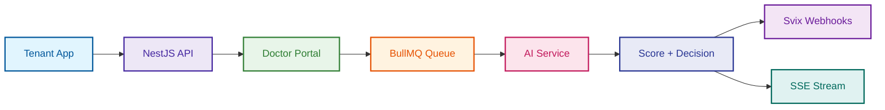

# Meayar — Backend API

[](https://nestjs.com/)
[](https://www.prisma.io/)
[](https://www.postgresql.org/)
[](https://redis.io/)
[](https://www.docker.com/)

**Keywords**: `Multi-tenant SaaS`, `Doctor Credential Verification`, `Algeria Digital Economy`, `BullMQ Pipeline`, `Webhook Delivery`, `Dual Auth`, `Portal Session`, `Svix`, `Cloudflare R2`.

> **The trust layer for the Algerian digital healthcare economy.** A multi-tenant API platform that allows healthcare organisations to verify doctor credentials programmatically — receiving results via webhook or real-time SSE stream.

## Description

Meayar provides a complete backend for automated medical credential verification. Tenants create a verification session, redirect the doctor to the Meayar portal, and receive a scored result (`approved`, `manual_review`, `rejected`) asynchronously. The platform handles document storage, AI pipeline orchestration, webhook delivery, and a human-in-the-loop review queue — all in a single hardened API.



## Why a Session-Based Portal?

Instead of requiring tenants to build their own document upload UI, Meayar provides a **hosted portal session**:

1. **Zero integration friction**: Tenants redirect doctors to `portalUrl` — no file upload code needed on their end.
2. **Security by design**: A cryptographically random 64-char session token acts as the portal's auth credential. No JWT required in the doctor's browser.
3. **Async by default**: The pipeline runs in the background. Results arrive via webhook or SSE — the tenant's app is never blocked.

## Human-in-the-Loop (HITL)

Every `manual_review` decision generates a **VerificationReport** that enters the review queue:

- **Explainable decisions**: Reports are AI-generated markdown explaining exactly what was flagged.
- **Inline review comments**: Reviewers can annotate specific findings before issuing a final `approved`/`rejected` decision.
- **Full audit trail**: Every lifecycle event writes an immutable `AuditLog` row — who did what, when, and why.

## Documentation

> [!IMPORTANT]
> **Explore the deep-dive guides** for architecture decisions, pipeline internals, and deployment steps.

Detailed documentation is available in the [docs/](docs/) folder:

### Architecture and Design
* **[System Architecture](docs/architecture.md)**: Module boundaries, shared layer, and key architectural decisions.
* **[Verification Pipeline](docs/verification_pipeline.md)**: The full lifecycle from portal submission to webhook delivery.
* **[Database Schema](docs/database_schema.md)**: All 13 models, relationships, and indexing strategy.
* **[Auth & Security](docs/auth_and_security.md)**: JWT, API key, session token, and FlexAuthGuard.

### Code and Setup
* **[Clean Code Structure](docs/clean_code.md)**: Project layout, path aliases, and design patterns.
* **[Setup Instructions](docs/setup.md)**: How to run the service locally.
* **[Deployment Guide](docs/deployment.md)**: Railway deployment and environment variables.

## Quick Start

```bash
# 1. Install dependencies
npm install

# 2. Configure environment
cp .env.example .env

# 3. Generate Prisma client + apply migrations
npx prisma generate
npx prisma migrate deploy

# 4. Seed system document templates
npm run db:seed

# 5. Start development server
npm run start:dev
```

Swagger UI available at `http://localhost:8000/api/docs`.

---

Meayar Backend — Innobyte, Algeria 2026.


---

## Table of Contents

1. [Architecture Overview](#architecture-overview)
2. [Project Structure](#project-structure)
3. [Database Schema](#database-schema)
4. [API Reference](#api-reference)
5. [Authentication & Authorization](#authentication--authorization)
6. [Verification Pipeline](#verification-pipeline)
7. [Environment Variables](#environment-variables)
8. [Getting Started](#getting-started)
9. [Development Scripts](#development-scripts)
10. [Configuration](#configuration)
11. [Security](#security)
12. [Deployment](#deployment)

---

## Architecture Overview

```text
┌─────────────────────────────────────────────────────────────┐
│                      NestJS API  :8000                      │
│                                                             │
│  ┌──────────┐  ┌──────────┐  ┌──────────┐  ┌───────────┐  │
│  │   Auth   │  │  Doctors │  │  Verify  │  │ Dashboard │  │
│  │  Module  │  │  Module  │  │  Module  │  │  Module   │  │
│  └──────────┘  └──────────┘  └────┬─────┘  └───────────┘  │
│                                   │                         │
│  ┌──────────┐  ┌──────────┐  ┌────┴─────┐  ┌───────────┐  │
│  │  Portal  │  │ Webhooks │  │ Reports  │  │ Templates │  │
│  │  Module  │  │  Module  │  │  Module  │  │  Module   │  │
│  └──────────┘  └──────────┘  └──────────┘  └───────────┘  │
│                                                             │
│  ┌─────────────────────────────────────────────────────┐    │
│  │                  Shared Layer (@Global)             │    │
│  │   PrismaModule · StorageModule · CacheModule        │    │
│  └──────────────────┬───────────────┬──────────────────┘    │
└─────────────────────┼───────────────┼───────────────────────┘
                      │               │
          ┌───────────▼──┐   ┌────────▼────────┐
          │  Neon / PG   │   │  Redis Cloud    │
          │  (Prisma 7)  │   │  BullMQ + SSE   │
          └──────────────┘   └─────────────────┘
```

### Key Architectural Decisions

| Concern | Choice | Rationale |
|---------|--------|-----------|
| ORM | Prisma 7 (WASM client) | Type-safe queries, Neon-compatible via `@prisma/adapter-pg`. Configured in `prisma.config.ts` |
| Queue | BullMQ over Redis | Durable job processing, retry logic, step-level persistence |
| Real-time | SSE over WebSockets | One-directional verification updates; simpler infra |
| Storage | Cloudflare R2 | S3-compatible, no egress fees, presigned URL support |
| Auth | JWT (access + refresh) + API Key | Dashboard users use JWT; API integrators use API keys |
| Multi-tenancy | Tenant ID on every row | Row-level isolation; single-schema, single-database |

---

## Project Structure

```text
backend/
├── prisma/
│   ├── schema.prisma           # Database schema (13 models)
│   ├── seed.ts                 # System document template seeder
│   └── migrations/             # Applied migration history
├── prisma.config.ts            # Prisma 7 CLI datasource config
├── src/
│   ├── main.ts                 # Bootstrap: Helmet, CORS, Swagger, ValidationPipe
│   ├── app.module.ts           # Root module — imports all feature modules
│   │
│   ├── config/                 # @nestjs/config typed configuration
│   │
│   ├── core/                   # Cross-cutting concerns — no business logic
│   │   ├── decorators/
│   │   ├── filters/
│   │   ├── guards/
│   │   ├── interceptors/
│   │   └── utils/
│   │
│   ├── shared/                 # @Global() injectable services
│   │   ├── prisma/             # PrismaClient with @prisma/adapter-pg
│   │   ├── storage/            # R2 upload, presigned URL generation
│   │   └── cache/              # ioredis publisher + subscriber
│   │
│   └── modules/                # Feature modules
│       ├── auth/               # Register, login, refresh, /me
│       ├── api-keys/           # CRUD for tenant API keys
│       ├── users/              # User profile management
│       ├── templates/          # Document template CRUD + field management
│       ├── documents/          # File upload + presigned URLs
│       ├── verifications/      # Verification lifecycle + SSE stream
│       ├── dashboard/          # Stats, activity feed, chart data
│       ├── doctors/            # Doctor CRUD, search, NIN uniqueness
│       ├── reports/            # Verification reports and manual review decisions
│       ├── webhooks/           # Webhook endpoints and deliveries management
│       └── portal/             # Public portal endpoints with session token auth
└── test/                       # Jest unit + e2e test scaffolding
```

---

## Database Schema

13 models across a single PostgreSQL schema. All primary keys are CUID strings. All timestamps are UTC.

```text
users
 ├── api_keys              (1:N)
 ├── doctors               (1:N) — NIN unique per tenant
 ├── verifications         (1:N)
 │    ├── verification_steps      (1:N)
 │    ├── documents               (1:N)
 │    ├── audit_logs              (1:N)
 │    └── verification_reports    (1:1)
 │         └── review_comments    (1:N)
 ├── tenant_configs        (1:1)
 └── webhook_endpoints     (1:N)

document_templates
 ├── document_template_fields  (1:N)
 └── documents                 (1:N — template used for a document)
```

### Model Summary

| Model | Key Fields | Notes |
|-------|-----------|-------|
| `User` | `email`, `companyName`, `planTier` | Tenant root entity |
| `ApiKey` | `keyHash`, `keyPrefix`, `permissions[]`, `rateLimit` | Keys are hashed (SHA-256); only prefix stored |
| `Doctor` | `nationalIdNumber`, `fullNameFr`, `fullNameAr`, `status` | NIN unique per tenant |
| `Verification` | `status`, `score`, `decision`, `sessionToken` | Statuses: `pending`, `processing`, `approved`, `rejected`, `manual_review` |
| `VerificationStep` | `stepType`, `status`, `resultJson`, `confidence` | One row per pipeline step |
| `VerificationReport` | `contentRaw`, `status`, `decision` | Created for manual review cases |
| `ReviewComment` | `content`, `authorId`, `reportId` | Inline comments by reviewers on reports |
| `DocumentTemplate` | `slug`, `docType`, `isSystem`, `fieldsSchemaJson` | 6 system templates seeded |
| `DocumentTemplateField` | `fieldName`, `fieldLabelFr`, `fieldLabelAr` | Bilingual field labels |
| `Document` | `docType`, `filePath`, `ocrResultJson`, `authenticityScore` | `filePath` is the R2 object key |
| `AuditLog` | `action`, `actor`, `detailsJson`, `timestamp` | Immutable; one per lifecycle event |
| `WebhookEndpoint` | `url`, `eventTypes`, `isActive`, `svixEndpointId` | Managed webhook endpoints for external deliveries |
| `TenantConfig` | `autoApproveThreshold`, `manualReviewThreshold` | Per-tenant workflow tuning |

---

## API Reference

### Base URL
```
http://localhost:8000/api
```

Interactive Swagger docs are available at `http://localhost:8000/api/docs` in non-production environments.

### Auth — `/api/auth`

| Method | Path | Auth | Description |
|--------|------|------|-------------|
| `POST` | `/auth/register` | Public | Register a new tenant account |
| `POST` | `/auth/login` | Public | Login, returns access + refresh tokens |
| `POST` | `/auth/refresh` | Public | Exchange refresh token for new access token |
| `GET` | `/auth/me` | JWT | Returns the current user profile |

### Portal — `/api/portal`

| Method | Path | Auth | Description |
|--------|------|------|-------------|
| `GET` | `/portal/session/:token` | Public | Fetch portal session data |
| `POST` | `/portal/documents/upload`| Session | Upload a document to the verification |
| `POST` | `/portal/submit` | Session | Submit verification for processing |
| `GET` | `/portal/stream/:token` | Public | SSE progress stream |

### Verifications — `JWT /api/verifications`

| Method | Path | Description |
|--------|------|-------------|
| `POST` | `/verifications` | Create verification session |
| `GET` | `/verifications` | List verifications with status filter |
| `GET` | `/verifications/:id` | Full verification detail |
| `GET` | `/verifications/:id/stream`| SSE stream for real-time step updates (Public) |

### Reports — `JWT /api/reports`

| Method | Path | Description |
|--------|------|-------------|
| `GET` | `/reports` | List verification reports (review queue) |
| `GET` | `/reports/by-verification/:id` | Get report by verification ID |
| `GET` | `/reports/:id` | Get a full report by ID |
| `POST` | `/reports/:id/decision` | Submit a human review decision |
| `POST` | `/reports/:id/comments` | Add an inline comment to a report thread |

### Webhooks — `JWT /api/webhooks/endpoints`

| Method | Path | Description |
|--------|------|-------------|
| `POST` | `/webhooks/endpoints` | Register a new webhook endpoint |
| `GET` | `/webhooks/endpoints` | List all webhook endpoints |
| `GET` | `/webhooks/endpoints/:id` | Get a webhook endpoint |
| `PATCH` | `/webhooks/endpoints/:id` | Update a webhook endpoint |
| `DELETE` | `/webhooks/endpoints/:id`| Delete a webhook endpoint |
| `GET` | `/webhooks/endpoints/:id/secret` | Get the signing secret for an endpoint |
| `POST` | `/webhooks/endpoints/:id/rotate-secret` | Rotate the signing secret |
| `GET` | `/webhooks/endpoints/:id/deliveries` | List recent delivery attempts |

*(See other modules including Dashboard, Doctors, Documents, Templates and API Keys API references directly in the interactive Swagger docs)*

---

## Authentication & Authorization

### JWT Flow

```text
POST /auth/login
  → { accessToken (15m), refreshToken (7d) }

All protected requests:
  Authorization: Bearer <accessToken>
```

### API Key Auth

For programmatic/integration access. Pass in the request header:
```text
x-api-key: it_live_xxxxxxxxxxxxxxxxxxxxxxxx
```

---

## Verification Pipeline

### Job Flow

```text
POST /portal/submit
  └─ Enqueues BullMQ job on queue: "verifications"

BullMQ Worker (VerificationProcessor)
  │
  ├─ Step 1: ai_extraction
  │    Calls AI microservice → stores extracted fields + confidence
  │
  ├─ Step 2: cnas_check
  │    Calls scraping microservice → stores CNAS affiliation status
  │
  ├─ Scoring
  │    score = ai_extraction.confidence
  │    decision:
  │      score ≥ autoApproveThreshold   → "approved"
  │      score ≥ manualReviewThreshold  → "manual_review"
  │      otherwise                      → "rejected"
  │
  ├─ Reports
  │    If decision is "manual_review" or "rejected":
  │      Generates VerificationReport using AiClientService
  │
  └─ Completion
       Updates Verification (status, score, decision, completedAt)
       Creates AuditLog entry
       Publishes to Redis channel "verification:{id}"
       → SSE subscribers receive the update immediately
```

---

## Environment Variables

Copy `.env.example` to `.env` and fill in all values before starting the server.

| Variable | Required | Description |
|----------|----------|-------------|
| `DATABASE_URL` | Yes | PostgreSQL connection string |
| `REDIS_URL` | Yes | Redis connection string |
| `JWT_SECRET` | Yes | Min 64 random characters |
| `R2_ACCOUNT_ID` | Yes | Cloudflare account ID |
| `R2_ACCESS_KEY_ID` | Yes | R2 API token key ID |
| `R2_SECRET_ACCESS_KEY` | Yes | R2 API token secret |
| `R2_BUCKET` | Yes | R2 bucket name |
| `R2_PUBLIC_URL` | No | Public R2 URL |

---

## Getting Started

### Installation

```bash
# 1. Install dependencies
npm install

# 2. Configure environment
cp .env.example .env

# 3. Generate Prisma client
npx prisma generate

# 4. Apply database migrations
npx prisma migrate deploy

# 5. Seed system document templates
npm run db:seed

# 6. Start development server
npm run start:dev
```

### Prisma CLI Reference (v7.8.0)

```bash
npx prisma migrate dev --name <migration_name>
npx prisma migrate deploy
npx prisma studio
npx prisma generate
npx prisma migrate reset
```

---

## Security

- **File validation**: Magic-byte inspection of the first 4 bytes.
- **Tenant isolation**: Every service-layer query is explicitly scoped by `tenantId`.
- **Prisma Exception Mapping**: Safe mapping of `P2002`, `P2025`, etc. to standard HTTP status codes.

---

## Deferred Modules

| Module | Dependency | Status |
|--------|-----------|--------|
| `AiClientModule` | AI microservice at `AI_SERVICE_URL` | Stubs in `verification.processor.ts` |
| `ScrapingClientModule` | CNAS scraping service at `SCRAPING_SERVICE_URL` | Stubs in `verification.processor.ts` |

---

## License

Private — all rights reserved. Innobyte, Algeria.
